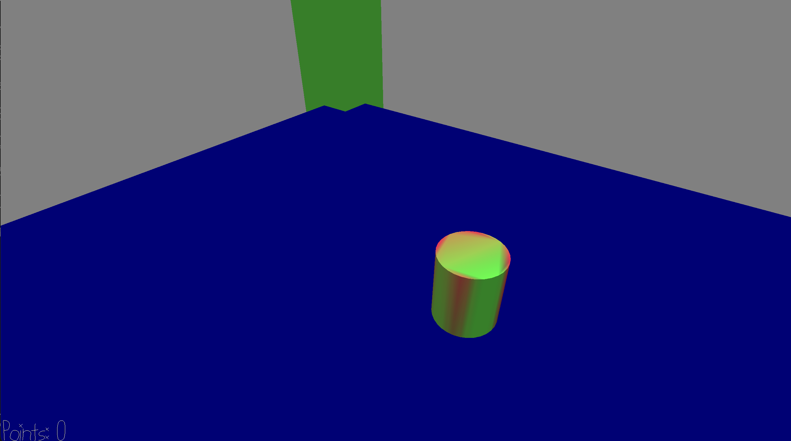

# Candy Biter

Author: Ari Liloia

Design: My game is a fast-paced 2d movement game that lets a player move around and pick up pieces of "candy". 

Screen Shot:

How To Play: Use the WASD keys and clicking on the screen to move your character / perspective around and look for pieces of candy. If you do not get to the piece of candy within three seconds, your score resets and you are warped back to the starting point. 

Comments: I only partially implemented my cross_edge function - on a 6x6 flat walkmesh, the user's movement appeared to be constrained to a 1x1 square. I tried to get around this issue affecting gameplay by making the player's height and the rest of the playing field smaller. I'm also trying to address the feedback I've gotten that my other games haven't had clear goals - the goal of this game is to beat your own high score and continuously score points. There is a way to lose and a way to do well. 

This game was built with [NEST](NEST.md).

